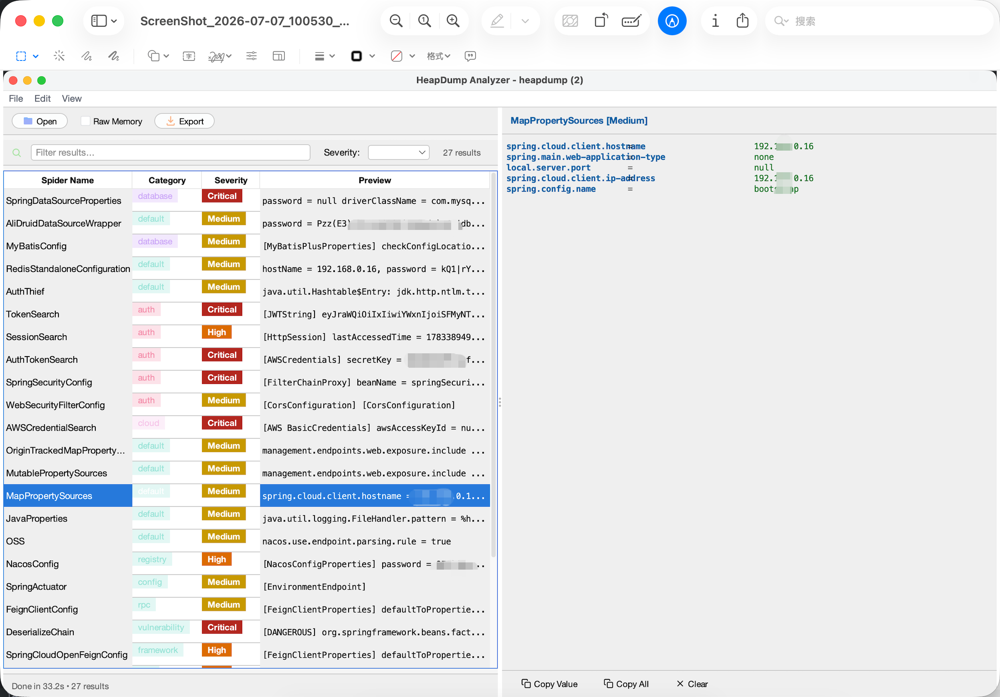

<div align="center">


<h1 align="center">HeapDump Analyzer</h1>

<p align="center">
  <strong>从JVM内存中挖掘机密凭证的安全分析神器</strong>
</p>

<p align="center">
  <em>直接从Java堆转储文件中提取凭证、令牌和敏感数据</em>
</p>

<p align="center">
  <a href="https://github.com/wanghw/heapdump-analyzer/stargazers">
    
  </a>
  <a href="https://github.com/wanghw/heapdump-analyzer/network/members">
    
  </a>
  <a href="https://github.com/wanghw/heapdump-analyzer/issues">
    
  </a>
  <a href="https://github.com/wanghw/heapdump-analyzer/blob/main/LICENSE">
    
  </a>
</p>

<p align="center">
  <a href="https://openjdk.org/">
    
  </a>
  <a href="#">
    
  </a>
  <a href="#">
    
  </a>
  <a href="#">
    
  </a>
  <a href="#">
    
  </a>
  <a href="https://github.com/wanghw/heapdump-analyzer/pulls">
    
  </a>
</p>

<p align="center">
  <a href="#快速开始">快速开始</a> •
  <a href="#核心功能">核心功能</a> •
  <a href="#截图">截图</a> •
  <a href="#对比">对比</a> •
  <a href="README.md">English</a> •
  <a href="docs/cases/">案例</a>
</p>

</div>

---

## 为什么需要 HeapDump Analyzer?

当Java应用发生OOM、执行`jmap`转储或触发JMX/JFR时,`.hprof`堆转储文件会落地到磁盘。传统工具(Eclipse MAT、JIFA)帮助你诊断**内存泄漏**,但HeapDump Analyzer回答一个不同的问题:

> **这个JVM此刻内存中持有哪些机密凭证?**

数据库密码、Redis认证令牌、AWS密钥、JWT签名密钥、Shiro密钥、Nacos凭证、OAuth客户端密钥、云服务令牌...所有这些都以**明文字段**形式存活在堆对象中。HeapDump Analyzer通过94个专用Spider插件和65条YAML规则枚举它们,并可选地验证这些凭证是否仍然**有效(LIVE)**。

---

## 核心功能

### 🔥 突破性的凭证提取能力

- **94个Spider插件** - 远超同类工具,覆盖10大类:
  - 🔑 **云服务**: AWS, GCP, Azure, 阿里云, 腾讯云, 华为云, K8s, Docker Registry
  - 💾 **数据库**: HikariCP, Druid, MyBatis, ClickHouse, HBase, Neo4j, InfluxDB
  - 🚀 **缓存**: Redis (Lettuce/Jedis), Memcached
  - 🛡️ **认证**: Shiro, Spring Security, SA-Token, JWT, OAuth2
  - ⚙️ **配置中心**: Nacos, Apollo, Spring Cloud Config, Dubbo, ZooKeeper
  - 📨 **消息队列**: Kafka, RocketMQ, RabbitMQ, ActiveMQ, Pulsar
  - 🌐 **HTTP客户端**: OkHttp拦截器, RestTemplate, Apache HttpClient, Feign
  - 🏗️ **微服务框架**: RuoYi, JeecgBoot, Eladmin, Pig, SpringBlade
  - 🔐 **凭证搜索**: TokenSearch, SessionSearch, CookieThief
  - 📊 **版本依赖**: Maven/Gradle依赖版本扫描

### 🎨 多样化的使用方式

- **🌐 Web UI** - 浏览器仪表板,支持暗色/亮色主题,实时统计图表,筛选过滤
- **🖥️ Swing GUI** - 现代化桌面界面(FlatLaf主题),拖拽打开文件,实时预览
- **⚡ CLI** - 命令行模式,适合自动化脚本和CI/CD集成
- **🔍 REPL** - 交互式OQL探索模式,类似jshell的heap探索
- **📦 批量扫描** - 一键扫描整个目录的所有堆转储文件

### 🔐 实时凭证验证(类似TruffleHog)

| 验证模式 | 功能 | 网络? |
|---|---|:---:|
| `--validate` | 离线格式校验(如AWS AKIA前缀、密钥校验位) | ❌ |
| `--validate-live` | 调用云API,标记每个凭证为 **LIVE/EXPIRED/UNKNOWN** | ✅ |

支持的实时验证器: **AWS**, **GitHub**, **Stripe**, **Slack**, **Telegram**  
离线格式验证器: Aliyun, GCP, Twilio, SendGrid, Firebase, JWK

> ⚠️ **警告**: `--validate-live`会发起真实的外部API调用,可能触发云平台的威胁检测系统(如AWS GuardDuty)。仅在授权资产上使用。

### 📊 YAML规则引擎 - 无需重编译即可扩展

```yaml
# ~/.heapdump-analyzer/rules/my-token.yml
kind: RegexRule
metadata:
  id: my-team-token
  name: Internal Team Token
  category: auth
  severity: CRITICAL
  description: 检测内部"team-xxxx" bearer令牌
spec:
  pattern: 'team-[A-Za-z0-9]{40}'
  validator: GitHubTokenValidator  # 可选
```

**规则类型支持**:
- `RegexRule` - 扫描所有字符串池
- `ClassRule` - 提取特定类的字段值

**65条内置规则**,涵盖:
- ☁️ 云服务密钥(AWS, Azure, GCP, Aliyun, Tencent等)
- 🔑 认证令牌(GitHub, GitLab, Slack, Stripe等)
- 💾 数据库连接(MySQL, PostgreSQL, MongoDB等)
- 📱 个人信息(邮箱、手机号、身份证等)
- 🔒 密码/加密字段(BCrypt, 明文密码等)

### 🚀 性能优化

- **并行扫描** - `--parallel --threads N` (默认使用CPU核心数)
- **批量扫描** - `--batch <dir>` 一键扫描整个目录
- **原始内存扫描** - `--extract-raw` 类似`strings`命令,扫描整个文件
- **分类过滤** - `--category <category>` 只扫描特定类别

### 📄 多格式输出

- **HTML报告** - 单文件自包含,包含严重性统计、分类图表、可筛选表格
- **JSON** - 结构化数据,适合API集成
- **CSV** - 表格格式,适合数据分析
- **文本** - 传统命令行输出

---

## 截图

### Web UI - 深色主题仪表板


默认着陆视图:顶部严重性卡片,分类&Spider图表,可筛选的结果表格

### Web UI - 浅色主题仪表板


从右上角☀️按钮切换浅色主题,适合日间阅读和屏幕共享

### Swing GUI - 现代化桌面界面



FlatLaf主题,左右分栏布局,实时预览详情

---

## 快速开始(3步)

```bash
# 1. 构建
./start.sh build

# 2. 扫描堆转储 - 文本输出到stdout
./start.sh cli /path/to/heapdump.hprof

# 3. 或生成可分享的HTML报告
java -jar target/heapdump-analyzer.jar heapdump.hprof --format html -o report.html
```

**打开Web UI浏览器仪表板**:

```bash
./start.sh web  # http://localhost:9090
```

**打开桌面GUI**:

```bash
./start.sh desktop
```

---

## 与同类工具对比

| 功能 | **HeapDump Analyzer** | JDumpSpider | heapdump_tool | Eclipse MAT |
|---|:---:|:---:|:---:|:---:|
| JDK兼容性 | 8/11/17/21 + GraalVM | 仅1.8 | any | any |
| Spider插件 | **94** (10大类) | ~20 | 关键词扫描 | — |
| 可扩展规则引擎 | ✅ YAML + Java | ❌ 硬编码 | ❌ | N/A |
| 实时凭证验证 | ✅ LIVE/EXPIRED/UNKNOWN | ❌ | ❌ | N/A |
| HTML报告导出 | ✅ 单文件自包含 | ❌ | ❌ | ❌ |
| Web UI | ✅ 浏览器仪表板 | ❌ | ❌ | ❌ |
| 桌面GUI | ✅ Swing(FlatLaf) | ❌ | ❌ | ✅ RCP |
| REPL(OQL探索) | ✅ | ❌ | ✅ | ❌ |
| 并行扫描 | ✅ `--parallel --threads N` | ❌ | ❌ | ❌ |
| 批量扫描 | ✅ `--batch <dir>` | ❌ | ❌ | ❌ |
| 维护状态 | **活跃开发** | 停滞 | 活跃 | 活跃 |
| 许可证 | Apache-2.0 | Apache-2.0 | — | EPL |

---

## CLI完整参数

```text
heapdump-analyzer <heapfile> [options]

输出格式:
  -f, --format <text|json|csv|html>   输出格式(默认: text)
  -o, --output <file>                 输出文件(默认: stdout)

扫描控制:
  -s, --spider <name,name|all>        运行特定Spider
      --severity <CRITICAL|HIGH|MEDIUM|LOW|INFO>  最小严重级别(默认: INFO)
      --category <category>           分类过滤: credential, pii, session等
      --parallel                      启用并行扫描
      --threads <N>                   线程数(默认: CPU核心数)
      --batch <dir>                   批量扫描目录中所有堆转储文件

规则引擎:
      --rules <dir>                   从目录加载额外YAML规则
      --rules-only                    仅运行规则引擎,跳过Spider
      --list-rules                    列出所有规则并退出
      --validate                      离线格式验证(无网络调用)
      --validate-live                 在线验证(调用云API!)
                                      警告:可能触发云平台告警

发现模式:
  -l, --list                          列出所有Spider并退出
      --extract <regex>               提取匹配正则的所有字符串
      --extract-raw <regex>           原始内存扫描(类似strings命令)

其他:
      --swing                         启动Swing GUI(默认)
      --web                           启动Web UI服务器
      --port <N>                      Web UI端口(默认: 9090)
      --repl                          启动交互式REPL
  -h, --help                          显示帮助
```

---

## 使用场景

### 1️⃣ 安全审计与渗透测试

```bash
# 扫描生产环境堆转储,发现暴露的凭证
java -jar heapdump-analyzer.jar prod.hprof --severity CRITICAL --format html -o audit-report.html
```

### 2️⃣ 事件响应与凭证轮换

```bash
# 验证泄露凭证是否仍然有效
java -jar heapdump-analyzer.jar leaked.hprof --validate-live --severity HIGH -o live-credentials.txt
```

### 3️⃣ CI/CD集成

```bash
# 自动化扫描作为安全检查步骤
./start.sh cli artifact.hprof --format json --severity HIGH --rules-only
```

### 4️⃣ 批量历史分析

```bash
# 扫描过去一周的所有堆转储文件
./start.sh batch /var/log/heapdumps/ --format html
```

---

## 实战案例

查看完整的案例研究: [从单个堆转储中提取50+云凭证](docs/cases/extract-50-cloud-credentials.md)

**真实案例亮点**:
- 从单个Spring Boot网关的1.4GB堆转储中提取**52个不同凭证源**
- 38个CRITICAL级别凭证,24个HIGH级别
- 通过实时验证发现8个**LIVE凭证**,立即轮换
- 涵盖云IAM(12),认证(11),数据库(9),消息队列(5),配置中心(7)

---

## 技术架构

### Spider插件体系

基于Java SPI (ServiceLoader)的可插拔架构:

```java
public interface ISpider {
    String getName();
    String getCategory();
    String getDescription();
    Severity getSeverity();
    String sniff(IHeapHolder heapHolder);
}
```

**实现方式**:
- 直接从JVM类实例提取字段值(如`BasicAWSCredentials`)
- 扫描字符串池(如正则匹配AWS密钥模式)
- 组合策略(类字段+字符串池)

### YAML规则引擎

```java
public class RuleEngine {
    private List<Rule> rules;
    private boolean validateEnabled;
    private boolean validateLiveEnabled;
    private boolean parallelEnabled;

    public List<RuleResult> execute(IHeapHolder heapHolder);
    public List<EnhancedResult> executeEnhanced(IHeapHolder heapHolder);
}
```

**规则类型**:
- `RegexRule` - 正则表达式扫描字符串池
- `ClassRule` - 直接从类实例提取字段

### 敏感信息分类系统

```java
public enum SensitivityCategory {
    CREDENTIAL("🔑", "凭证", "#f38ba8"),    // 密码、密钥、Token
    PII("📱", "个人信息", "#fab387"),        // 手机、邮箱、身份证
    SESSION("🍪", "会话数据", "#f9e2af"),    // Cookie、Session
    NETWORK("🌐", "网络信息", "#89dceb"),    // IP、URL
    DATABASE("💾", "数据库", "#cba6f7"),    // 连接字符串、密码
    CLOUD("☁️", "云服务", "#f5c2e7"),       // AWS、Azure、GCP密钥
    CONFIG("⚙️", "配置信息", "#94e2d5");    // 配置文件敏感项
}
```

### 堆转储解析器

- **GraalVM VisualVM Heap Library** - JDK 9+ 支持HPROF格式
- **NetBeans Profiler Heap Library** - JDK 8兼容
- **自动版本检测** - 根据文件格式和Java class version选择解析器

---

## 贡献指南

我们**刻意简化了贡献流程**,最快的参与方式是**添加一个Spider或YAML规则**:

### 添加新Spider(5分钟)

```java
// src/main/java/cn/wanghw/spider/MyCloudCredentialSearch.java
public class MyCloudCredentialSearch implements ISpider {
    public String getName() { return "MyCloudCredentialSearch"; }
    public String getCategory() { return "cloud"; }
    public String getDescription() { return "Extract MyCloud credentials"; }
    public Severity getSeverity() { return Severity.CRITICAL; }

    public String sniff(IHeapHolder heapHolder) {
        Object clazz = heapHolder.findClass("com.mycloud.Credentials");
        // ... 提取逻辑
    }
}
```

然后添加到 `src/main/resources/META-INF/services/cn.wanghw.ISpider`

### 添加新YAML规则(2分钟)

```yaml
# src/main/resources/rules/cloud/mycloud-key.yml
kind: RegexRule
metadata:
  id: mycloud-api-key
  name: MyCloud API Key
  category: cloud
  severity: CRITICAL
  description: Detect MyCloud API keys
spec:
  pattern: 'MC-[A-Za-z0-9]{32}'
```

详见: [CONTRIBUTING.md](.github/CONTRIBUTING.md)

---

## 致谢

HeapDump Analyzer建立在以下优秀项目的基础上:

- [JDumpSpider](https://github.com/whwlsfb/JDumpSpider) - 原始Spider概念与堆解析
- [Eclipse MAT](https://github.com/eclipse-mat/mat) & [JIFA](https://github.com/eclipse/jifa) - 堆转储参考
- [TruffleHog](https://github.com/trufflesecurity/trufflehog) & [Gitleaks](https://github.com/gitleaks/gitleaks) - 凭证验证灵感
- GraalVM VisualVM & NetBeans Profiler Libraries - HPROF解析

---

## 法律声明与负责任使用

本工具读取你运营或明确授权评估的JVM堆转储中的明文机密。它**不执行任何漏洞利用**。凭证实时验证仅识别密钥是否有效,不窃取数据。仅用于**防御性审计、事件响应和授权安全测试**。

---

## 许可证

Apache License 2.0 © wanghw and contributors.

---

<div align="center">

<p>
  <a href="README.md">English</a> •
  <a href=".github/CONTRIBUTING.md">贡献指南</a> •
  <a href="docs/cases/">实战案例</a> •
  <a href="https://github.com/wanghw/heapdump-analyzer/issues">问题反馈</a>
</p>

<p>
  如果这个项目帮助了你的安全工作,请考虑给一个 ⭐️ Star!
</p>

**Made with ❤️ by the security community**

</div>