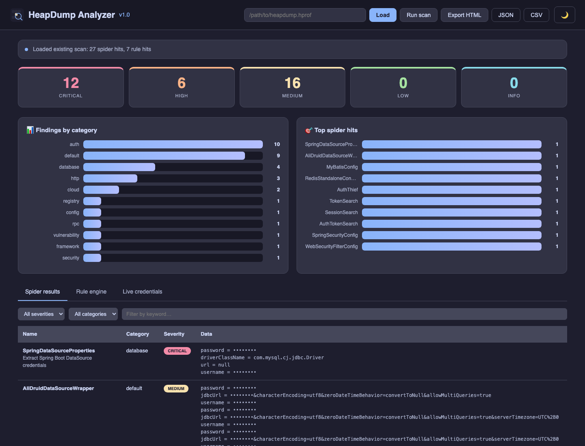
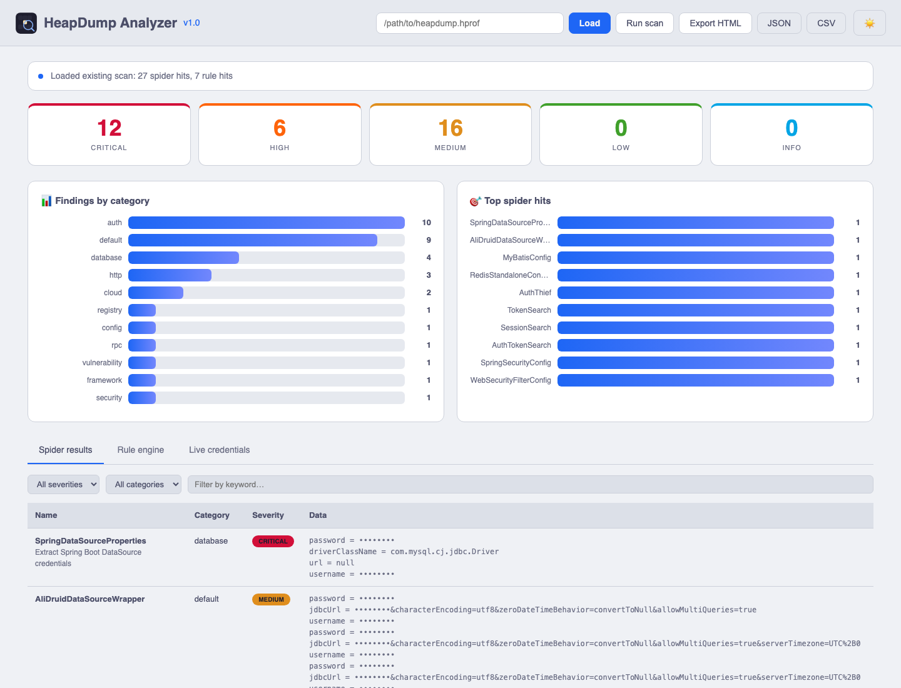
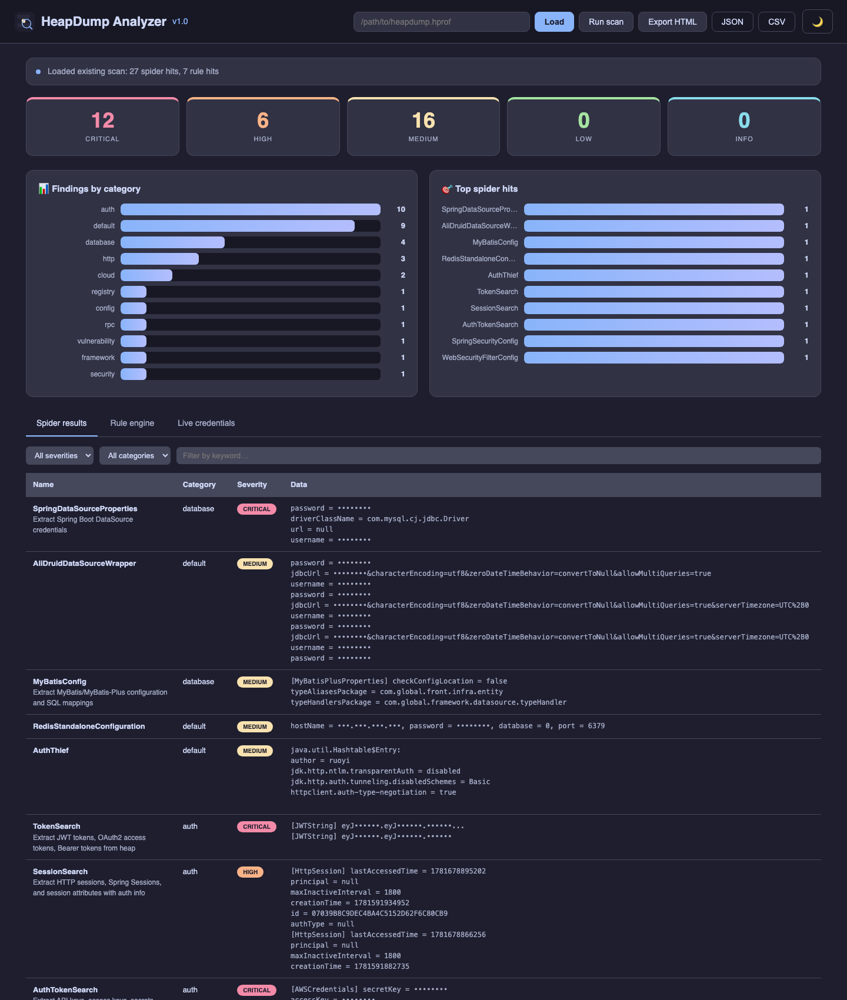
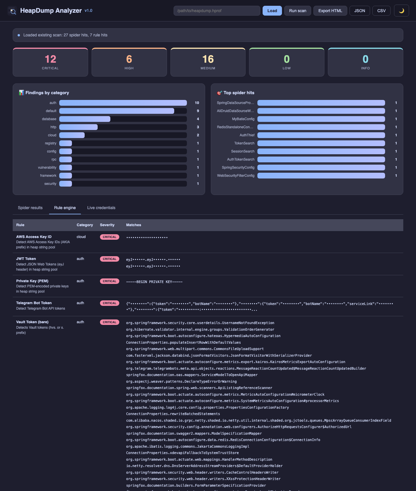

<div align="center">


# 从 JVM 内存里挖出秘密

[](LICENSE)
[](https://openjdk.org/)
[](#)
[](#spider-插件)
[](#规则引擎)
[](.github/CONTRIBUTING.md)

**HeapDump Analyzer** 是一款以安全为目标的 Java 堆内存分析工具，能够**直接从 JVM
内存**中提取凭证、Token、配置等敏感数据——这些运行时明文从不会落盘。

它在一个开源工具里集成了**堆内存解析**、**94 个 Spider 插件**、**可扩展的 YAML 规则引擎**、
**凭证存活验证**、**浏览器 Web UI**、**JavaFX 桌面 GUI** 与 **HTML 报告导出**，专为红队、
渗透测试人员与 SRE 设计——回答"这台 JVM 此刻到底握着哪些秘密"。

</div>

---

## 背景

当 Java 应用发生 OOM、被 `jmap` 触发或经 JMX/JFR 抓取后，磁盘上会落下一个 `.hprof`
堆转储。传统工具（Eclipse MAT、JIFA）帮你**诊断内存泄漏**；**HeapDump Analyzer** 回答另一个问题：

> *这台 JVM 内存里此刻有哪些秘密？*

数据库密码、Redis Token、AWS 密钥、JWT 签名密钥、Shiro 密钥、Nacos 凭证、OAuth
客户端密钥、云服务 Token——全部以明文字段存在于堆对象中。本工具用 94 个专用 Spider 与
65 条 YAML 规则枚举它们，并可选地对凭证调用云厂商 API 验证是否仍**LIVE**（类似 TruffleHog）。

## 竞品对比

| 特性 | **HeapDump Analyzer** | JDumpSpider | heapdump_tool | Eclipse MAT |
|---|:---:|:---:|:---:|:---:|
| JDK 兼容 | 8 / 11 / 17 / 21 + GraalVM | 仅 1.8 | 任意 | 任意 |
| Spider 插件 | **94**（10 大类） | ~20 | 关键词扫描 | — |
| 可扩展规则引擎 | ✅ YAML + Java | ❌ 硬编码 | ❌ | N/A |
| 凭证存活验证 | ✅ LIVE / EXPIRED / UNKNOWN | ❌ | ❌ | N/A |
| HTML 报告导出 | ✅ 自包含 | ❌ | ❌ | ❌ |
| Web UI（浏览器仪表盘） | ✅ | ❌ | ❌ | ❌ |
| 桌面 GUI | ✅ JavaFX | ❌ | ❌ | ✅ RCP |
| REPL（OQL 探索） | ✅ | ❌ | ✅ | ❌ |
| 并行扫描 | ✅ `--parallel --threads N` | ❌ | ❌ | ❌ |
| 批量扫描 | ✅ `--batch <dir>` | ❌ | ❌ | ❌ |
| 维护状态 | **活跃** | 停滞 | 活跃 | 活跃 |
| 协议 | Apache-2.0 | Apache-2.0 | — | EPL |

## 三步上手

```bash
# 1. 构建 fat jar（需 JDK 17+）
./start.sh build

# 2. 扫描堆转储——文本输出到终端
./start.sh cli /path/to/heapdump.hprof

# 3. 或生成可分享的 HTML 报告
java -jar target/heapdump-analyzer.jar /path/to/heapdump.hprof --format html -o report.html
```

直接启动 Web UI，在浏览器里点开仪表盘：

```bash
./start.sh web            # http://localhost:9090
```

## 运行模式

| 模式 | 命令 | 用途 |
|---|---|---|
| **Web UI** | `./start.sh web [端口]` | 浏览器仪表盘：Severity 卡片、图表、过滤、导出 |
| **桌面 GUI** | `./start.sh desktop` | JavaFX 本地分析 |
| **CLI** | `./start.sh cli <文件>` | 无头/脚本化扫描 |
| **批量** | `./start.sh batch <目录>` | 一次扫描目录下所有堆转储 |
| **REPL** | `./start.sh repl <文件>` | 交互式 OQL / 堆探索 |

## CLI 参数

```text
heapdump-analyzer <堆文件> [选项]

输出：
  -f, --format <text|json|csv|html>   输出格式（默认 text）
  -o, --output <文件>                 输出文件（默认 stdout）

扫描：
  -s, --spider <名称,名称|all>        只跑指定 Spider
      --severity <CRITICAL|HIGH|MEDIUM|LOW|INFO>  最低严重等级（默认 INFO）
      --parallel                      开启并行扫描
      --threads <N>                   线程数（默认 CPU 核数）
      --batch <目录>                   扫描目录下所有堆转储

规则引擎：
      --rules <目录>                   从目录加载额外 YAML 规则
      --rules-only                    只跑规则引擎，跳过 Spider
      --list-rules                    列出所有规则后退出
      --validate                      离线格式校验候选凭证
      --validate-live                 在线验证（调用云 API！）
                                      警告：可能触发云告警，默认关闭。

发现：
  -l, --list                          列出所有 Spider 后退出
      --extract <正则>                 导出所有匹配正则的字符串

其它：
      --web                           启动 Web UI 服务
      --port <N>                      Web UI 端口（默认 9090）
      --desktop / --gui               启动 JavaFX 桌面 GUI
      --repl                          启动交互式 REPL
  -h, --help                          显示帮助
```

## Spider 插件

94 个 Spider 分布在 10 大类，按命名 JVM 类提取结构化数据：

| 类别 | 示例 |
|---|---|
| 数据库 | HikariCP、Druid、MyBatis、ClickHouse、HBase、Neo4j、InfluxDB |
| 缓存 | Redis（Lettuce/Jedis）、Memcached |
| 认证 | Shiro、Spring Security、SA-Token、CAS、PAC4J、JWT 密钥 |
| 云服务 | AWS、GCP、Azure、阿里云、华为云、腾讯云、K8s SA、Docker registry |
| 配置 | Nacos、Apollo、Spring Cloud、Dubbo、Seata、ZooKeeper |
| 消息队列 | Kafka、RocketMQ、RabbitMQ、ActiveMQ、Pulsar |
| 注册中心 | Eureka、Nacos、Consul、ZooKeeper |
| 框架 | RuoYi、JeecgBoot、Eladmin、Pig、SpringBlade、HuTool |
| HTTP | OkHttp 拦截器、RestTemplate、Apache HttpClient、Feign |
| 凭证 | TokenSearch、SessionSearch、AuthTokenSearch、CookieThief |

列出全部：

```bash
java -jar target/heapdump-analyzer.jar --list
```

## 规则引擎

YAML 规则引擎让你**无需重新编译**即可新增秘密匹配模式。规则从内置 `resources/rules/`
加载，并自动从 `~/.heapdump-analyzer/rules/` 加载。

```yaml
# ~/.heapdump-analyzer/rules/my-team-token.yml
kind: RegexRule
metadata:
  id: my-team-token
  name: 内部团队 Token
  category: auth
  severity: HIGH
  description: 检测内部 "team-xxxx" bearer token
spec:
  pattern: 'team-[A-Za-z0-9]{40}'
  validator: GitHubTokenValidator   # 可选
```

支持的规则类型：`RegexRule`（扫描所有字符串）与 `ClassRule`（从命名类提取字段）。
**5 分钟加一个 Spider / 规则** 教程见 [`.github/CONTRIBUTING.md`](.github/CONTRIBUTING.md)。

## 凭证验证

分两级，默认全部关闭以避免噪声：

| 参数 | 行为 | 联网? |
|---|---|:---:|
| `--validate` | 离线格式/启发式校验（如 AKIA 前缀、密钥校验位） | ❌ |
| `--validate-live` | 调用云厂商 API，给每个凭证打 `LIVE` / `EXPIRED` / `UNKNOWN` | ✅ |

支持在线验证：**AWS**、**GitHub**、**Stripe**、**Slack**、**Telegram**；离线格式校验：
阿里云 / GCP / Twilio / SendGrid / Firebase / JWK。

> ⚠️ **`--validate-live` 会发起真实外联 API 调用。** AWS GuardDuty 等云威胁检测可能
> 告警。仅在你拥有并授权测试的资产上启用。

## HTML 报告

```bash
java -jar target/heapdump-analyzer.jar heap.hprof --format html -o report.html
```

生成**单一自包含** HTML 文件——无外部 CDN、无缺图——含 Severity 统计、分类图表与可过滤
详情表。可直接邮件 / Slack / 工单分享，离线可读。

## 配置

| 位置 | 用途 |
|---|---|
| `~/.heapdump-analyzer/rules/` | 放自定义 YAML 规则，自动加载 |
| `--rules <目录>` | 指向任意规则目录 |

## 截图

### Web UI — 暗色仪表盘

默认首屏：顶部 Severity 卡片、分类图表与 Top Spider 命中图，下方是可过滤的 Spider
结果表。暗色主题为默认。



### Web UI — 亮色仪表盘

同一仪表盘切换到亮色主题（右上角 ☀️ 按钮切换），适合白天阅读与明亮投影环境下的
屏幕分享。



### Web UI — Spider 结果

每条命中的详情：Spider 名称、分类、Severity 标签，以及从堆里提取出的原始明文（可折叠
`<pre>`，支持 Severity 横向过滤与关键词搜索）。



### Web UI — 规则引擎

**Rule engine** 标签页列出每条 YAML 规则的命中——规则名、分类、Severity，以及每条
匹配字符串（离线校验与在线验证结果内联展示）。



> 截图基于示例堆转储拍摄，文档展示时对敏感数据做了显示层脱敏。真实扫描会直接展示
> 明文秘密——这正是本工具的目的。

## 贡献

欢迎贡献——而且刻意做得简单。最快的帮忙方式是为你遇到的框架/凭证**新增一个 Spider 或
YAML 规则**。5 分钟教程、本地构建（`./start.sh build`）与 PR 清单见
[`.github/CONTRIBUTING.md`](.github/CONTRIBUTING.md)。

## 致谢

站在巨人的肩膀上：

- [JDumpSpider](https://github.com/whwlsfb/JDumpSpider) —— 原始 Spider 思路与堆解析
- [Eclipse MAT](https://github.com/eclipse-mat/mat) & [JIFA](https://github.com/eclipse/jifa) —— 堆转储参考实现
- [TruffleHog](https://github.com/trufflesecurity/trufflehog) & [Gitleaks](https://github.com/gitleaks/gitleaks) —— 凭证验证灵感
- GraalVM VisualVM 与 NetBeans profiler 库 —— HPROF 解析

## 协议

[Apache License 2.0](LICENSE) © wanghw 及贡献者。

## 合规说明

本工具仅从**你运营或明确授权评估**的 JVM 堆转储中读取明文秘密，**不进行任何利用**。
凭证在线验证仅判断密钥是否仍有效，不外泄数据。请仅用于防御性审计、应急响应与授权安全测试。

---

<div align="center">

**[English](README.md)** · [贡献指南](.github/CONTRIBUTING.md) · [案例集](docs/cases/) · [升级规划](docs/UPGRADE_PLAN_v4.0.md)

</div>
